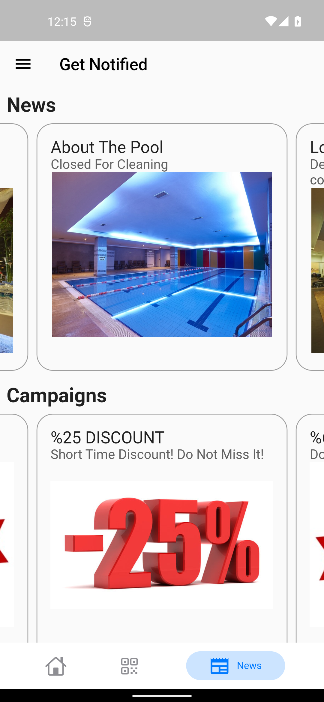

# Gym Pro - Connects You With Your Club!

This is a Flutter sample app written in Dart following *no* architecture principles.

## Todo
The purpose of this app to showcase:

- Example: Clone the X app for both iOS and Android

### Screenshots From The App

Onboarding 1 | Onboarding 2 | Onboarding 3
:-------------------------:|:-------------------------:|:-------------------------:|
 |  |  |

Login 1 | Login 2 | Login 3
:-------------------------:|:-------------------------:|:-------------------------:|
 |  |  |

Signup 1 | Signup 2 | Forgot Password
:-------------------------:|:-------------------------:|:-------------------------:|
 |  |  |

Dashboard 1 | Dashboard 2 | Drawer 1
:-------------------------:|:-------------------------:|:-------------------------:|
 |  |  |

Notify Me | Add Progress 1 | Add Progress 2
:-------------------------:|:-------------------------:|:-------------------------:|
 |  |  |

WebBrowser | QR Page 1   | QR Page 2
:-------------------------:|:-------------------------:|:-------------------------:|
 |  |  |

## Todo

## Languages, libraries and tools used
- Example: [Kotlin](https://kotlinlang.org/)
